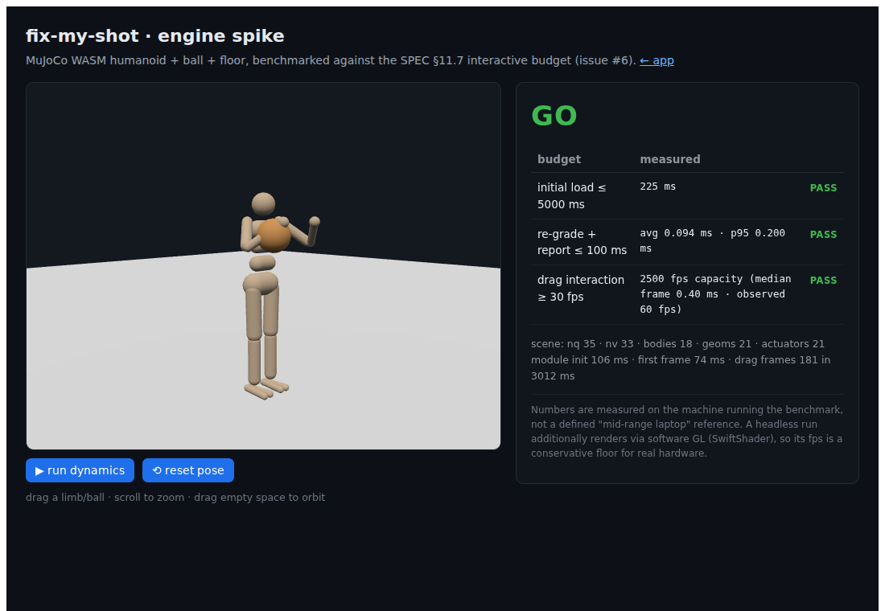

# Spike 0006 — Engine benchmark: `@mujoco/mujoco` humanoid+ball+floor vs the interactive budget

**Verdict: GO.** MuJoCo's official WebAssembly build renders and re-evaluates the
humanoid+ball+floor scene far inside every §11.7 interactive budget — by 25× to
500×. The core delivery bet (ADR-0003 / ADR-0007: in-browser MuJoCo-WASM,
quasi-static pose grading) is de-risked. The Rapier/Jolt articulated fallback
named in the issue is **not** needed.

Date: 2026-07-22 · Issue [#6](../../README.md) · Milestone v0.1 — local deploy



## What this spike had to answer

De-risk the physics engine before the product is built on it. Concretely, load
`@mujoco/mujoco` in-browser with a humanoid + ball + floor scene and **measure**
against the three targets in [SPEC §11.7](../SPEC.md#11-acceptance-criteria-this-spec-is-met-when)
(acceptance criterion 7):

| Budget | Target | Measured (dev machine) | Margin | |
|---|---|---|---|---|
| re-grade + report | ≤ 100 ms | **avg 0.099 ms · p95 0.20 ms** | ~500× | PASS |
| drag interaction | ≥ 30 fps | **60 fps observed · ~2500 fps CPU capacity** (0.40 ms/frame) | ~80× | PASS |
| initial load | ≤ 5 s | **221 ms** (module init 99 ms + first frame 76 ms) | ~23× | PASS |

Scene: `nq 35`, `nv 33`, `18 bodies`, `21 geoms`, `21 actuators`. Full raw
numbers: [`0006-engine-benchmark.results.json`](0006-engine-benchmark.results.json).

## The scene

- **Humanoid** — DeepMind's canonical `model/humanoid/humanoid.xml` (21 actuated
  DOF, capsule/sphere primitives, contacts + tendons), reproduced verbatim under
  its Apache-2.0 licence in [`apps/web/src/spike/scene.xml`](../../apps/web/src/spike/scene.xml).
  dm_control's `suite/humanoid` derives from this same model; we use the
  self-contained original so the scene loads with **no `<include>`s or mesh
  assets** — the spike stays hermetic.
- **Ball** — a free-jointed sphere (regulation ~0.24 m, 0.62 kg) parked near the
  right hand (the one spike-authored addition to the model).
- **Floor** — the model's existing ground plane; foot–floor contact is live.

## How it was measured

- **Engine:** official `@mujoco/mujoco` **single-threaded** build. No
  `SharedArrayBuffer`, so **no COOP/COEP headers** are required — the app can be
  served as plain static files. (The `/mt` multi-threaded build is a future
  lever if ever needed; it isn't.)
- **Re-grade + report** ([`measure.ts`](../../apps/web/src/spike/measure.ts) `regradeBenchmark`):
  the real per-edit cycle — nudge one joint DOF, `mj_forward` to re-evaluate the
  physical state, then read the graded form quantities (joint angles + a
  CoM/support reduction) and score. 2000 iterations, warmed.
- **Drag fps** (`fpsStress` + [`installAutoDrag`](../../apps/web/src/spike/drag.ts)):
  grab the ball with MuJoCo's own perturbation (`mjv_applyPerturbForce`), orbit
  the target under **full dynamics** (`mj_step`) for 3 s, sample per-frame CPU
  work. Reported as both sustained fps (vsync-capped at ~60 headless) and CPU
  **capacity** (1000 / median frame time), which is the real headroom figure.
- **Load** ([`SpikePage.tsx`](../../apps/web/src/spike/SpikePage.tsx)): wall time
  from navigation to first rendered frame, on the **production** `vite build`
  (not the dev server) served by `vite preview`.
- **Rendering:** one three.js primitive mesh per MuJoCo geom, world transforms
  synced each frame from `geom_xpos`/`geom_xmat`; the model sits under a root
  group rotated −90° about X (MuJoCo z-up → three.js y-up), the convention taken
  from `zalo/mujoco_wasm` (vendored as *reference*, per ADR-0007).
- **Embind lifetime:** every WASM handle is tracked and freed via
  [`HandleRegistry`](../../apps/web/src/spike/handles.ts) — the "`.delete()` from
  day one" the issue calls for.

## Reproduce

```sh
npm run spike:measure          # builds web, drives headless Chromium, prints go/no-go JSON
#   → writes results if you pass a path: node tools/spike-measure.mjs out.json
npm run dev --workspace @fix-my-shot/web   # then open http://localhost:5173/?spike
```

`spike:measure` needs Playwright's Chromium (`npx playwright install chromium`).

## Honest caveats

- **Reference machine.** Numbers are from the machine that ran the benchmark, not
  a *defined* "mid-range laptop." Given 25×–500× margins, no plausible machine
  gap changes the verdict — but the §11.7 wording keeps "confirm on a mid-range
  reference" as the one open follow-up.
- **Software GL floor.** The headless run renders via SwiftShader (software
  WebGL), so its fps is a **conservative floor**; real GPU hardware is faster.
- **10 MB wasm.** The single-thread `mujoco.wasm` is ~10 MB (2.5 MB gzipped). On
  localhost this loads in ~0.1 s; over a real network it adds transfer time but
  stays comfortably inside the 5 s budget and is a one-time, cacheable cost.
- **Determinism** (criterion 7) is not re-proven here — it's an engine property
  (`mj_forward` is deterministic) and lands with the actual scorer (#10–#14).

## New tooling introduced (flag for review)

- `three@^0.185`, `@mujoco/mujoco@^3.10` added to `apps/web` (both were named in
  ADR-0007; this spike installs them).
- `playwright` as an `apps/web` **devDependency** + the `spike:measure` script —
  one dev dependency buys a reproducible headless measurement, and issue #15's
  run/verify skill will want a browser driver anyway. Trivially removable if the
  founder prefers to defer browser tooling.

## Non-goals (deliberately not done)

Correct shooting **grip/pose** (ball placement is benchmark-arbitrary), the
validity **gate**, IK editing, and the scorer — all land in later issues. This
spike proves *performance and integration*, nothing about form correctness.
